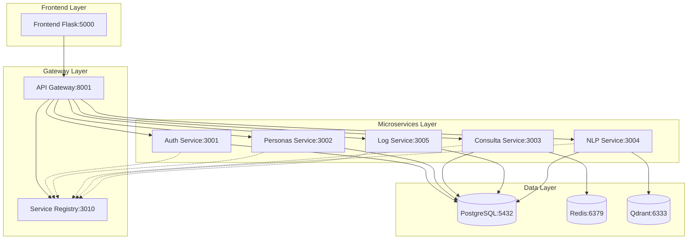
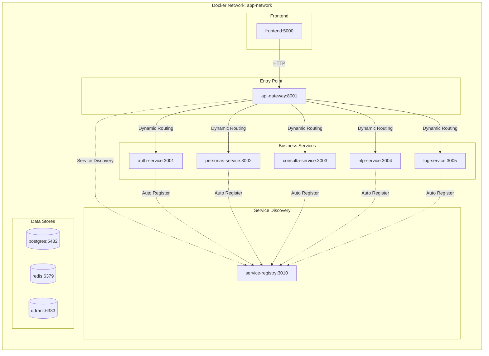

# 🚀 Sistema de Gestión de Personas - Versión 3.0

Sistema completo de gestión de datos personales con **arquitectura de microservicios autodescubrible**, interfaz moderna, autenticación avanzada, notificaciones inteligentes y sistema de consultas mejorado con IA.

## ✨ Características Principales

- 🏗️ **Arquitectura de Microservicios** escalable con **Service Registry autodescubrible**
- 🔐 **Autenticación JWT completa** con sesiones seguras y Auth0 integration
- 🔍 **Búsqueda avanzada** con filtros dinámicos y resultados en tiempo real
- 🤖 **Consultas en lenguaje natural** usando IA (Google Gemini + RAG)
- 📊 **Dashboard interactivo** con estadísticas y refrescos automáticos
- 📝 **Sistema de auditoría** completo con logs detallados
- 🚀 **Cache inteligente** optimizado para performance
- 📱 **Interfaz moderna** responsive con Bootstrap 5.3
- 🔔 **Sistema de notificaciones** avanzado con historial
- 🎨 **Temas dinámicos** (claro/oscuro/automático)
- ⚡ **Validación en tiempo real** y manejo de errores mejorado
- 🌐 **Service Discovery** automático con health checks y heartbeats
- 🔄 **Load Balancing** inteligente y fault tolerance

## 🆕 Últimas Mejoras (Septiembre 2025) - v3.0

### 🌐 **Service Registry Implementation**

- ✅ **Autodescubrimiento de servicios** - Registro automático al inicio
- ✅ **Health checks continuos** - Heartbeats cada 15 segundos
- ✅ **Service discovery dinámico** - El gateway encuentra servicios automáticamente
- ✅ **Fault tolerance** - Re-registro automático en caso de fallos
- ✅ **Metadata enriquecida** - Versiones, tags, capabilities por servicio
- ✅ **Graceful shutdown** - Desregistro limpio al cerrar servicios

### 🎨 **Interfaz y UX**

- ✅ **Tema oscuro completo** - Soporte mejorado para modo oscuro
- ✅ **Sistema de notificaciones dropdown** - Historial de sesión con contador
- ✅ **Validación en tiempo real** - Verificación de documentos existentes
- ✅ **Navegación mejorada** - Flujo usuario → notificaciones optimizado
- ✅ **Dashboard con auto-refresh** - Datos actualizados automáticamente

### 🔧 **Funcionalidad y Performance**

- ✅ **Manejo de errores avanzado** - Códigos HTTP específicos (409, 422, etc.)
- ✅ **Búsqueda silenciosa en logs** - Sin notificaciones molestas
- ✅ **Cache invalidation** inteligente en dashboard
- ✅ **Contenedores renombrados** - Consistencia en nomenclatura
- ✅ **Debugging mejorado** - Logs detallados para troubleshooting

### 🚀 **Backend y API**

- ✅ **Error 409 handling** - Documentos duplicados correctamente manejados
- ✅ **Gateway error forwarding** - Códigos de estado preservados
- ✅ **Session storage** - Persistencia de notificaciones por sesión
- ✅ **API response optimization** - Mejores tiempos de respuesta

## 🏗️ Arquitectura del Sistema



### Componentes Principales

**🌐 Service Registry (Puerto 3010)**

- **Autodescubrimiento**: Registro automático de todos los servicios
- **Health monitoring**: Verificación continua del estado de servicios
- **Service discovery**: API para localizar servicios dinámicamente
- **Metadata management**: Versiones, tags, capabilities por servicio
- **Fault tolerance**: Re-registro automático y cleanup de servicios caídos

**🔗 API Gateway (Puerto 8001)**

- **Service discovery client**: Conecta con Service Registry automáticamente
- **Dynamic routing**: Enrutamiento basado en servicios registrados
- **Rate limiting**: Protección contra ataques DDoS
- **Request forwarding**: Preservación de códigos de estado HTTP
- **CORS handling**: Configuración centralizada para frontend

**🔐 Auth Service (Puerto 3001)**

- **JWT Authentication**: Tokens seguros con expiración configurable
- **Auth0 Integration**: Login social y empresarial
- **Session management**: Redis para sesiones distribuidas
- **Password security**: Bcrypt hashing y validación fuerte
- **Auto-registration**: Se registra automáticamente en Service Registry

**👥 Personas Service (Puerto 3002)**

- **CRUD completo**: Create, Read, Update, Delete con validaciones
- **Image handling**: Upload, resize y serving de fotos
- **Document validation**: Verificación de duplicados en tiempo real
- **Audit logging**: Registro completo de operaciones
- **Scalable design**: Preparado para múltiples réplicas

**🔍 Consulta Service (Puerto 3003)**

- **Advanced search**: Filtros múltiples con paginación optimizada
- **Redis caching**: Cache inteligente con TTL configurable
- **Silent search**: Búsquedas sin notificaciones para logs
- **Performance optimization**: Índices de base de datos optimizados
- **Load balancing ready**: Soporte para réplicas múltiples

**🤖 NLP Service (Puerto 3004)**

- **Google Gemini AI**: Procesamiento de lenguaje natural avanzado
- **Vector search**: Búsquedas semánticas con Qdrant
- **RAG implementation**: Retrieval-Augmented Generation
- **Embedding generation**: Vectorización de consultas y documentos
- **Context-aware responses**: Respuestas inteligentes y contextuales

**📊 Log Service (Puerto 3005)**

- **Transaction logging**: Registro completo de operaciones del sistema
- **Audit trail**: Trazabilidad total con timestamps y metadata
- **Advanced filtering**: Búsqueda por fecha, usuario, acción, entidad
- **Performance metrics**: Estadísticas de uso y rendimiento
- **Data analytics**: Insights y reportes automatizados

**🎨 Frontend Flask (Puerto 5000)**

- **Responsive UI**: Bootstrap 5.3 con temas dinámicos
- **Real-time validation**: Verificación de campos mientras escribes
- **Notification system**: Toast notifications con historial persistente
- **Theme management**: Modo claro/oscuro/automático
- **Progressive enhancement**: Funcionalidad básica sin JavaScript

### Bases de Datos y Storage

**🐘 PostgreSQL (Puerto 5432)**

- **Primary data**: Personas, usuarios, logs de transacciones
- **ACID compliance**: Transacciones seguras y consistentes
- **Connection pooling**: Optimización de conexiones
- **Backup strategy**: Snapshots automáticos y point-in-time recovery
- **Indexing**: Optimizado para consultas frecuentes

**🔴 Redis (Puerto 6379)**

- **Session storage**: Sesiones JWT distribuidas
- **Query caching**: Cache de consultas con TTL inteligente
- **Rate limiting**: Contadores para API Gateway
- **Real-time data**: Estados temporales y notificaciones
- **Pub/Sub**: Comunicación en tiempo real entre servicios

**🔍 Qdrant Vector Database (Puerto 6333)**

- **Semantic search**: Búsquedas por similitud semántica
- **AI embeddings**: Vectores generados por Google Gemini
- **High performance**: Búsquedas vectoriales optimizadas
- **Scalable storage**: Diseñado para grandes volúmenes de datos
- **REST API**: Integración simple con servicios NLP

## 🚀 Quick Start (Setup en 3 pasos)

### 1. 📥 Clonar e inicializar

```bash
git clone https://github.com/tu-usuario/gestion-personas-app.git
cd gestion-personas-app
cp env.example .env
```

### 2. ⚙️ Configurar API Key (Opcional)

Edita `.env` y agrega tu Gemini API Key:

```bash
GEMINI_API_KEY=tu_api_key_aqui
```

*Nota: Sin esto, las consultas NLP no funcionarán, pero el resto del sistema sí.*

### 3. 🐳 Levantar el sistema

```bash
# Construir y ejecutar todos los servicios
docker-compose up -d

# Ver logs en tiempo real (opcional)
docker-compose logs -f
```

### 4. 🌐 Acceder a la aplicación

**URL Principal:** <http://localhost:5000>

**URLs de Monitoreo:**

- **Service Registry:** <http://localhost:3010/services> (Ver servicios registrados)
- **API Gateway Health:** <http://localhost:8001/health> (Estado del gateway)
- **Qdrant Dashboard:** <http://localhost:6333/dashboard> (Vector database)

**Credenciales por defecto:**

- Usuario: `admin`
- Contraseña: `admin123`

## 🔗 API Endpoints Principales

### 🌐 Service Registry API (Puerto 3010)

```bash
# Ver todos los servicios registrados
GET /services
curl http://localhost:3010/services

# Descubrir un servicio específico
GET /discover/{serviceName}
curl http://localhost:3010/discover/auth-service

# Health check del registry
GET /health
curl http://localhost:3010/health

# Registrar un servicio (usado internamente)
POST /register
{
  "serviceId": "mi-servicio",
  "name": "mi-servicio", 
  "host": "mi-servicio",
  "port": 3006,
  "metadata": {
    "version": "1.0.0",
    "tags": ["api", "backend"]
  }
}

# Enviar heartbeat (usado internamente)
POST /heartbeat
{
  "serviceId": "mi-servicio"
}

# Desregistrar servicio (usado internamente)
DELETE /services/{serviceId}
```

### 🔐 Authentication API (Puerto 8001)

```bash
# Login JWT
POST /api/auth/login
{
  "username": "admin",
  "password": "admin123"
}

# Registro de usuario
POST /api/auth/register
{
  "username": "nuevo_usuario",
  "email": "user@example.com",
  "password": "password123"
}

# Login con Auth0
GET /api/auth/login/auth0

# Logout
POST /api/auth/logout
```

### 👥 Personas API (Puerto 8001)

```bash
# Crear persona
POST /api/personas
Authorization: Bearer {token}
{
  "numero_documento": "1234567890",
  "tipo_documento": "Cédula",
  "primer_nombre": "Juan",
  "apellidos": "Pérez García",
  "fecha_nacimiento": "1990-05-15",
  "genero": "Masculino",
  "correo_electronico": "juan@example.com",
  "celular": "3001234567"
}

# Listar personas con paginación
GET /api/personas?page=1&limit=10
Authorization: Bearer {token}

# Buscar persona por documento
GET /api/personas/documento/{numero_documento}
Authorization: Bearer {token}

# Verificar si documento existe (para validación)
GET /api/personas/existe/{numero_document}
Authorization: Bearer {token}

# Actualizar persona
PUT /api/personas/{id}
Authorization: Bearer {token}

# Eliminar persona
DELETE /api/personas/{id}
Authorization: Bearer {token}
```

### 🔍 Consulta Avanzada API (Puerto 8001)

```bash
# Búsqueda avanzada con filtros
GET /api/consulta/search?tipo_documento=Cédula&genero=Masculino&limit=20
Authorization: Bearer {token}

# Búsqueda por nombre
GET /api/consulta/nombre?q=Juan&page=1&limit=10
Authorization: Bearer {token}

# Búsqueda por rango de edad
GET /api/consulta/edad?min_edad=18&max_edad=65
Authorization: Bearer {token}

# Estadísticas de consulta
GET /api/consulta/stats
Authorization: Bearer {token}
```

### 🤖 NLP API (Puerto 8001)

```bash
# Consulta en lenguaje natural
POST /api/nlp/consulta
Authorization: Bearer {token}
{
  "pregunta": "¿Cuántas personas hay de Bogotá menores de 30 años?"
}

# Búsqueda semántica
POST /api/nlp/buscar
Authorization: Bearer {token}
{
  "query": "personas jóvenes estudiantes",
  "limit": 10
}
```

### 📊 Logs y Auditoría API (Puerto 8001)

```bash
# Buscar logs con filtros
GET /api/logs/search?transaction_type=CREATE&status=SUCCESS&limit=50
Authorization: Bearer {token}

# Estadísticas de transacciones
GET /api/logs/stats
Authorization: Bearer {token}

# Logs por usuario
GET /api/logs/user/{user_id}
Authorization: Bearer {token}

# Limpiar logs antiguos
DELETE /api/logs/cleanup?days=30
Authorization: Bearer {token}
```

## 🔧 Desarrollo y Mantenimiento

### Comandos útiles

```bash
# Parar todos los servicios
docker-compose down

# Rebuild completo (después de cambios de código)
docker-compose down
docker-compose build --no-cache
docker-compose up -d

# Ver logs de un servicio específico
docker-compose logs -f frontend
docker-compose logs -f service-registry
docker-compose logs -f auth-service
docker-compose logs -f personas-service

# Restart de un servicio específico
docker-compose restart frontend
docker-compose restart service-registry

# Ver estado de servicios
docker-compose ps

# Acceso directo a la base de datos
docker exec -it personas_db psql -U admin -d personas_db

# Monitorear Service Registry en tiempo real
watch -n 2 'curl -s http://localhost:3010/services | jq'
```

### Verificar instalación completa

```bash
# Health check de todos los servicios
curl http://localhost:8001/health | jq

# Verificar Service Registry
curl http://localhost:3010/services | jq

# Test de autenticación completo
curl -X POST http://localhost:8001/api/auth/login \
  -H "Content-Type: application/json" \
  -d '{"username":"admin","password":"admin123"}' | jq

# Verificar autodescubrimiento de servicios
echo "Servicios registrados automáticamente:"
curl -s http://localhost:3010/services | jq '.services[] | {name: .name, url: .url, status: .status}'

# Test de conexión Gateway → Servicios
for service in auth-service personas-service consulta-service nlp-service log-service; do
  echo "Testing discovery for $service:"
  curl -s http://localhost:3010/discover/$service | jq '.instance.url'
done
```

## 📱 Funcionalidades Completas

### 🏠 Dashboard Principal

- **Estadísticas en tiempo real**: Total de personas, registros por género, distribución por ciudad
- **Auto-refresh inteligente**: Datos actualizados cada 30 segundos con cache invalidation
- **Búsqueda rápida**: Acceso directo a funciones principales
- **Navegación intuitiva**: Menú Bootstrap responsive con tema dinámico
- **Notificaciones centralizadas**: Dropdown con historial de sesión y contador

### 👥 Gestión de Personas

1. **Crear Personas**:
   - Formulario completo con validaciones en tiempo real
   - Verificación de documentos duplicados (Error 409)
   - Mensajes de error específicos y descriptivos
   - Upload de fotos con preview

2. **Modificar Datos**:
   - Actualización con búsqueda previa y navegación mejorada
   - Validación de campos en tiempo real
   - Preservación de datos originales durante edición

3. **Consultar Datos**:
   - 🔍 **Búsqueda individual** por documento con validación
   - 🎯 **Búsqueda avanzada** con filtros múltiples y paginación
   - ⚡ **Resultados en tiempo real** optimizados
   - 📊 **Cache inteligente** para consultas frecuentes

4. **Eliminar Personas**:
   - Proceso seguro con confirmación doble
   - Verificación de existencia antes de eliminar
   - Logging completo de eliminaciones

### 🤖 Consultas Inteligentes

- **Lenguaje Natural**: "¿Cuántas personas hay de Bogotá menores de 30 años?"
- **IA con RAG**: Análisis semántico usando Google Gemini
- **Respuestas contextuales**: Interpretación inteligente de consultas
- **Vector database**: Búsquedas semánticas con Qdrant

### 📊 Auditoría y Logs

- **Registro completo** de todas las operaciones (CREATE, READ, UPDATE, DELETE)
- **Búsqueda silenciosa** - Sin notificaciones molestas al consultar
- **Filtros avanzados** por fecha, usuario, acción, tipo de entidad
- **Trazabilidad total** con timestamps y detalles de solicitudes
- **Exportación de datos** para análisis

### 🔔 Sistema de Notificaciones Avanzado

- **Toast notifications** modernas con iconos y colores
- **Dropdown de historial** con persistencia de sesión
- **Contador dinámico** con animaciones
- **Estados de leído/no leído** para seguimiento
- **Limpieza automática** y manual de notificaciones
- **Integración completa** con todos los módulos del sistema

### 🎨 Temas y Accesibilidad

- **Tema claro/oscuro/automático** con transiciones suaves
- **Modo oscuro completo** - Todos los componentes optimizados
- **Accesibilidad WCAG** - Screen readers y navegación por teclado
- **Responsive design** - Móvil, tablet y desktop
- **Shortcuts de teclado** - Ctrl+Shift+T para cambiar tema

### ✅ Validaciones y Manejo de Errores

| Campo | Validación | Ejemplo | Error Handling |
|-------|------------|---------|----------------|
| Primer/Segundo Nombre | Solo letras, máx 30 chars | "Juan Carlos" | Validación en tiempo real |
| Apellidos | Solo letras, máx 60 chars | "García López" | Formato automático |
| Documento | Solo números, máx 10 chars | "1234567890" | **Verificación de duplicados** |
| Fecha Nacimiento | No futura, calendario | "1990-05-15" | Validación de edad |
| Género | Lista: M/F/Otro/Prefiero no decir | "Masculino" | Selección obligatoria |
| Email | Formato válido | "<user@domain.com>" | Verificación sintáctica |
| Celular | Exactamente 10 dígitos | "3001234567" | Formato colombiano |
| Foto | Máx 2MB, jpg/png/gif | upload.jpg | Preview y validación |

#### 🛡️ **Códigos de Error Específicos**

- **400 Bad Request**: Datos inválidos con detalles específicos
- **409 Conflict**: "❌ Ya existe una persona con este documento"
- **422 Unprocessable Entity**: Errores de validación con campo específico
- **500 Server Error**: Errores internos con logging automático
- **404 Not Found**: Persona no encontrada en consultas

## 🔧 Configuración Avanzada

## 🐳 Estructura Docker y Contenedores

### Contenedores en Desarrollo

```yaml
# docker-compose.dev.yml estructura
services:
  # Service Registry - Núcleo de autodescubrimiento
  service-registry:
    container_name: service_registry_dev
    ports: ["3010:3010"]
    volumes: ["./services/registry:/app", "/app/node_modules"]
    environment:
      - NODE_ENV=development
      - SERVICE_REGISTRY_PORT=3010

  # API Gateway - Punto de entrada con service discovery
  gateway:
    container_name: api_gateway_dev  
    ports: ["8001:8001"]
    volumes: ["./gateway:/app", "/app/node_modules"]
    environment:
      - SERVICE_REGISTRY_URL=http://service-registry:3010

  # Microservicios - Autoregistro en Service Registry
  auth-service:
    container_name: auth_service_dev
    volumes: 
      - "./services/auth:/app"
      - "./services/shared:/app/shared"  # Cliente Service Registry
      - "/app/node_modules"
    environment:
      - SERVICE_REGISTRY_URL=http://service-registry:3010
      - SERVICE_NAME=auth-service
      - SERVICE_PORT=3001

  personas-service:
    container_name: personas_service_dev
    volumes:
      - "./services/personas:/app"  
      - "./services/shared:/app/shared"  # Cliente Service Registry
      - "/app/node_modules"
    environment:
      - SERVICE_REGISTRY_URL=http://service-registry:3010
      - SERVICE_NAME=personas-service
      - SERVICE_PORT=3002

  # ... otros servicios con estructura similar
```

### Red de Servicios y Comunicación



### Volúmenes y Persistencia

```bash
# Volúmenes definidos
volumes:
  personas_data:        # PostgreSQL data
  personas_redis_data:  # Redis persistence
  personas_uploads:     # Images y archivos
  qdrant_storage:       # Vector database
  
# Bind mounts en desarrollo
./services/shared:/app/shared          # Service Registry Client compartido
./services/registry:/app              # Hot reload Service Registry
./services/auth:/app                  # Hot reload Auth Service
./services/personas:/app              # Hot reload Personas Service
./services/consulta:/app              # Hot reload Consulta Service
./services/nlp:/app                   # Hot reload NLP Service
./services/log:/app                   # Hot reload Log Service
./gateway:/app                        # Hot reload API Gateway
./frontend:/app                       # Hot reload Frontend
```

### Optimizaciones Implementadas

#### 🚀 Cache Strategy

- **Redis TTL**: 5 minutos para consultas frecuentes
- **Anti-cache headers**: Búsquedas avanzadas sin cache
- **Session management**: Limpieza automática de estado

#### ⚡ Performance

- **Conexiones pooling**: PostgreSQL optimizado
- **Índices database**: Consultas rápidas
- **Rate limiting**: API Gateway protegido
- **Escalabilidad**: Consulta service con réplicas

#### 🔧 Correcciones y Mejoras Recientes (Septiembre 2025)

##### 🎨 **Interfaz y UX**

1. ✅ **Tema oscuro mejorado**: Textos legibles en todos los componentes
2. ✅ **Sistema de notificaciones dropdown**: Historial con contador y persistencia
3. ✅ **Navegación optimizada**: Usuario → Notificaciones (lado derecho)
4. ✅ **Dashboard auto-refresh**: Invalidación de cache cada 30 segundos
5. ✅ **Validación en tiempo real**: Documentos duplicados detectados al escribir

##### 🔧 **Backend y Performance**

1. ✅ **Error 409 handling**: Documentos duplicados manejados correctamente
2. ✅ **Gateway error forwarding**: Códigos HTTP preservados en respuestas
3. ✅ **Búsqueda silenciosa**: Logs sin notificaciones molestas al usuario
4. ✅ **Container renaming**: consulta_service_dev para consistencia
5. ✅ **Session storage**: Notificaciones persistentes durante la sesión

##### 🚀 **Nuevas Características**

- **NotificationHistory**: Clase JavaScript para gestión de historial
- **AJAX form validation**: Verificación en tiempo real sin recargas
- **Theme manager mejorado**: Transiciones suaves entre temas
- **Error display específico**: Mensajes detallados para cada tipo de error
- **Cache invalidation**: Sistema inteligente para datos actualizados

#### 🔧 Correcciones Anteriores (Enero 2025)

1. ✅ **Fixed**: Navegación "Buscar Otra Persona" ahora limpia el estado
2. ✅ **Fixed**: Búsqueda avanzada muestra resultados actualizados en tiempo real
3. ✅ **Fixed**: Anti-cache headers en servicio de consultas
4. ✅ **Improved**: Session management y limpieza de estado

### Logs y Debugging

```bash
# Ver logs en tiempo real
docker-compose logs -f --tail=100

# Logs específicos por servicio
docker-compose logs -f frontend
docker-compose logs -f consulta-service
docker-compose logs -f personas-service

# Acceso a containers
docker exec -it flask_app bash
docker exec -it personas_db psql -U admin -d personas_db
docker exec -it personas_redis redis-cli
```

## � Monitoreo y Performance

### Health Checks

- **Frontend**: <http://localhost:5000/health>
- **API Gateway**: <http://localhost:8001/health>
- **Database**: Conexión automática verificada

### Métricas de Performance

- **Response time**: < 200ms para consultas simples
- **Throughput**: 1000+ requests/min
- **Cache hit ratio**: > 80% en consultas frecuentes
- **Memory usage**: < 2GB total system

### Estadísticas del Sistema

- **Total requests**: Tracking en logs
- **Active users**: Session management
- **Database size**: Monitoring automático
- **Error rates**: < 1% target

## 🔒 Seguridad y Mejores Prácticas

### Seguridad Implementada

- 🔐 **JWT Authentication** con expiración
- 🛡️ **Rate limiting** en API Gateway
- 🔍 **Input validation** exhaustiva
- 📝 **Audit trail** completo
- 🚫 **SQL injection** prevention
- 🔒 **Session security** con secrets

### Producción Checklist

- [ ] Cambiar credenciales por defecto
- [ ] Configurar HTTPS/SSL
- [ ] Backup automático de database
- [ ] Monitoring y alertas
- [ ] Log rotation
- [ ] Security updates
- [ ] Load balancer setup
- [ ] CDN para assets estáticos

## 🧪 Testing y Calidad de Código

### Entorno de Testing Dockerizado

El proyecto incluye un **entorno de testing completamente automatizado** que permite ejecutar tests de forma aislada sin afectar el entorno de desarrollo.

#### 🚀 Quick Start

```bash
# Opción 1: Script interactivo
cd gestion-personas-app
./test-quickstart.sh

# Opción 2: Comandos Make
make test              # Ejecutar TODOS los tests
make test-unit         # Solo tests unitarios
make test-integration  # Solo tests de integración
make test-e2e          # Solo tests E2E
make test-coverage     # Generar reporte de cobertura
```

#### 📊 Tipos de Tests

- **Unitarios**: Tests de funciones individuales
- **Integración**: Tests de API endpoints y bases de datos
- **E2E**: Tests de flujo completo con Playwright
- **Frontend**: Tests de Python con pytest

#### 📈 Cobertura y Reportes

```bash
# Ver resultados interactivamente
./view-test-results.sh

# O consultar reportes
make test-results

# Reportes disponibles en:
# - test-results/index.html (consolidado)
# - test-results/coverage-python/index.html
# - test-results/coverage/*/index.html
```

#### 🐳 Servicios de Test

El entorno incluye:

- PostgreSQL Test (puerto 5433, tmpfs)
- Redis Test (puerto 6380, tmpfs)
- Service Registry Test
- Gateway Test
- Test Runners (Node.js, Python, E2E)

#### 📚 Documentación Completa

- **Guía Completa**: [`gestion-personas-app/TESTING-GUIDE.md`](gestion-personas-app/TESTING-GUIDE.md)
- **Quick Reference**: [`gestion-personas-app/TESTING-README.md`](gestion-personas-app/TESTING-README.md)
- **Setup Summary**: [`gestion-personas-app/TEST-SETUP-SUMMARY.md`](gestion-personas-app/TEST-SETUP-SUMMARY.md)

#### ✅ Verificar Setup

```bash
cd gestion-personas-app
./check-test-setup.sh
```

## 📄 Licencia y Contacto

**Licencia**: MIT License
