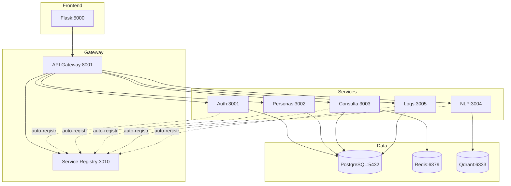
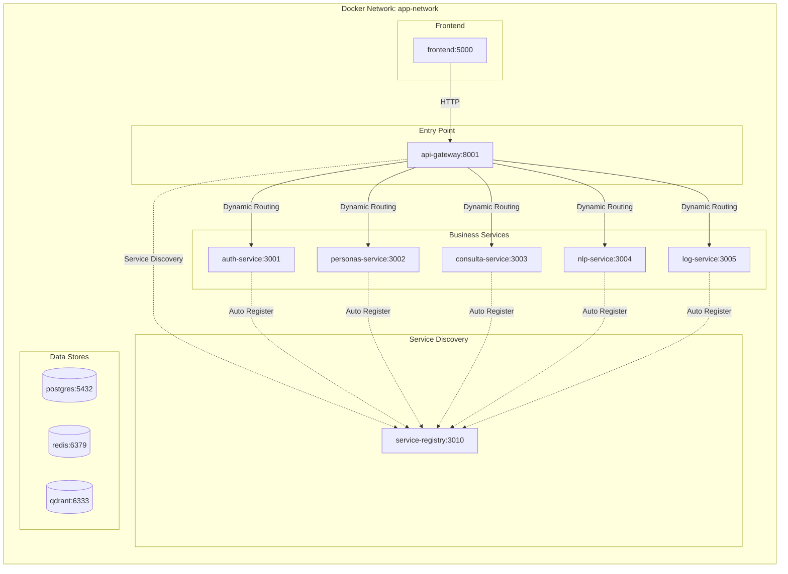

# 🚀 Sistema de Gestión de Personas - v3.0

Sistema completo de gestión de datos personales con **arquitectura de microservicios autodescubrible**, interfaz moderna, autenticación avanzada y consultas inteligentes con IA.

## ✨ Características Principales

- 🏗️ **Microservicios escalables** con Service Registry autodescubrible
- 🔐 **Autenticación JWT + Auth0** con sesiones distribuidas
- 🔍 **Búsqueda avanzada** con filtros y cache inteligente
- 🤖 **Consultas en lenguaje natural** (Google Gemini + RAG)
- 📊 **Dashboard interactivo** con auto-refresh
- 📝 **Sistema de auditoría** completo
- 🎨 **Temas dinámicos** (claro/oscuro/automático)
- 🔔 **Notificaciones avanzadas** con historial

## 🏗️ Arquitectura



### Componentes Clave

| Componente | Puerto | Función | Tecnología |
|------------|--------|---------|------------|
| **Frontend** | 5000 | UI responsive con temas | Flask + Bootstrap 5.3 |
| **Service Registry** | 3010 | Autodescubrimiento de servicios | Node.js |
| **API Gateway** | 8001 | Routing dinámico + rate limiting | Express.js |
| **Auth Service** | 3001 | JWT + Auth0 + sesiones | Node.js + PostgreSQL + Redis |
| **Personas Service** | 3002 | CRUD + validación + imágenes | Node.js + PostgreSQL |
| **Consulta Service** | 3003 | Búsqueda avanzada + cache | Node.js + PostgreSQL + Redis |
| **NLP Service** | 3004 | Consultas IA + búsqueda semántica | Node.js + Gemini + Qdrant |
| **Log Service** | 3005 | Auditoría y trazabilidad | Node.js + PostgreSQL |

## 🚀 Quick Start

### 1. Clonar e Inicializar

```bash
git clone <repo-url>
cd gestion-personas-app
cp .env.example .env
```

### 2. Configurar (Opcional)

Edita `.env` para añadir Gemini API Key:

```bash
GEMINI_API_KEY=tu_api_key_aqui
```

### 3. Levantar Servicios

```bash
# Producción
docker-compose up -d

# Desarrollo (hot reload)
make dev
```

### 4. Acceder

- **App**: <http://localhost:5000>
- **Service Registry**: <http://localhost:3010/services>
- **API Gateway Health**: <http://localhost:8001/health>

**Credenciales**: `admin` / `admin123`

## 📡 API Endpoints Principales

### Autenticación

```bash
# Login
POST /api/auth/login
{ "username": "admin", "password": "admin123" }

# Registro
POST /api/auth/register
{ "username": "user", "email": "user@example.com", "password": "pass" }
```

### Personas (CRUD)

```bash
# Crear
POST /api/personas
Authorization: Bearer {token}

# Listar
GET /api/personas?page=1&limit=20

# Buscar por documento
GET /api/personas/documento/{numero}

# Verificar existencia
GET /api/personas/existe/{numero}

# Actualizar
PUT /api/personas/{id}

# Eliminar
DELETE /api/personas/{id}
```

### Búsqueda Avanzada

```bash
# Filtros múltiples
GET /api/consulta/search?tipo_documento=Cédula&genero=Masculino

# Por nombre
GET /api/consulta/nombre?q=Juan&page=1

# Estadísticas
GET /api/consulta/stats
```

### NLP

```bash
# Consulta en lenguaje natural
POST /api/nlp/consulta
{ "pregunta": "¿Cuántas personas hay de Bogotá menores de 30 años?" }

# Búsqueda semántica
POST /api/nlp/buscar
{ "query": "personas jóvenes estudiantes", "limit": 10 }
```

### Logs y Auditoría

```bash
# Filtrar logs
GET /api/logs/search?transaction_type=CREATE&status=SUCCESS

# Estadísticas
GET /api/logs/stats
```

## 🔧 Comandos de Desarrollo

### Producción

```bash
make build      # Construir imágenes
make up         # Iniciar servicios
make down       # Detener servicios
make logs       # Ver logs
```

### Desarrollo (Hot Reload)

```bash
make dev        # Iniciar con hot reload
make logs-dev   # Ver logs de desarrollo
make down-dev   # Detener desarrollo
```

### Base de Datos

```bash
make db-backup   # Backup manual
make db-restore  # Restaurar desde backup
make db-reset    # Reset completo (⚠️ destructivo)
make db-status   # Ver estadísticas
```

### Testing

```bash
make test              # Todos los tests
make test-unit         # Solo unitarios
make test-integration  # Solo integración
make test-e2e          # Solo E2E
make test-coverage     # Generar cobertura
```

### Debugging

```bash
# Logs específicos
docker-compose logs -f frontend
docker-compose logs -f service-registry
docker-compose logs -f personas-service

# Health checks
curl http://localhost:8001/health | jq
curl http://localhost:3010/services | jq

# Monitoreo en tiempo real
watch -n 2 'curl -s http://localhost:3010/services | jq ".services | length"'
```

## 📊 Funcionalidades Principales

### Dashboard

- ✅ Estadísticas en tiempo real (auto-refresh 30s)
- ✅ Distribución por género/ciudad/edad
- ✅ Gráficos interactivos (Plotly.js)
- ✅ Cache invalidation inteligente

### Gestión de Personas

- ✅ CRUD completo con validación en tiempo real
- ✅ Verificación de duplicados (código 409)
- ✅ Upload de imágenes (resize automático)
- ✅ Búsqueda avanzada con filtros
- ✅ Carga masiva CSV

### Consultas Inteligentes

- ✅ Lenguaje natural con Google Gemini
- ✅ Búsqueda semántica con Qdrant
- ✅ Respuestas contextuales y análisis

### Auditoría

- ✅ Registro completo de operaciones
- ✅ Filtros avanzados (fecha, usuario, acción)
- ✅ Trazabilidad total con timestamps
- ✅ Búsqueda silenciosa (sin notificaciones)

### Notificaciones

- ✅ Toast modernas con iconos/colores
- ✅ Dropdown con historial de sesión
- ✅ Contador dinámico con animaciones
- ✅ Estados leído/no leído

### Temas

- ✅ Claro/oscuro/automático
- ✅ Persistencia en sessionStorage
- ✅ Transiciones suaves
- ✅ Shortcut: `Ctrl+Shift+T`

## 🔧 Configuración Avanzada

## 🐳 Estructura Docker y Contenedores

### Contenedores en Desarrollo

```yaml
# docker-compose.dev.yml estructura
services:
  # Service Registry - Núcleo de autodescubrimiento
  service-registry:
    container_name: service_registry_dev
    ports: ["3010:3010"]
    volumes: ["./services/registry:/app", "/app/node_modules"]
    environment:
      - NODE_ENV=development
      - SERVICE_REGISTRY_PORT=3010

  # API Gateway - Punto de entrada con service discovery
  gateway:
    container_name: api_gateway_dev  
    ports: ["8001:8001"]
    volumes: ["./gateway:/app", "/app/node_modules"]
    environment:
      - SERVICE_REGISTRY_URL=http://service-registry:3010

  # Microservicios - Autoregistro en Service Registry
  auth-service:
    container_name: auth_service_dev
    volumes: 
      - "./services/auth:/app"
      - "./services/shared:/app/shared"  # Cliente Service Registry
      - "/app/node_modules"
    environment:
      - SERVICE_REGISTRY_URL=http://service-registry:3010
      - SERVICE_NAME=auth-service
      - SERVICE_PORT=3001

  personas-service:
    container_name: personas_service_dev
    volumes:
      - "./services/personas:/app"  
      - "./services/shared:/app/shared"  # Cliente Service Registry
      - "/app/node_modules"
    environment:
      - SERVICE_REGISTRY_URL=http://service-registry:3010
      - SERVICE_NAME=personas-service
      - SERVICE_PORT=3002

  # ... otros servicios con estructura similar
```

### Red de Servicios y Comunicación



### Volúmenes y Persistencia

```bash
# Volúmenes definidos
volumes:
  personas_data:        # PostgreSQL data
  personas_redis_data:  # Redis persistence
  personas_uploads:     # Images y archivos
  qdrant_storage:       # Vector database
  
# Bind mounts en desarrollo
./services/shared:/app/shared          # Service Registry Client compartido
./services/registry:/app              # Hot reload Service Registry
./services/auth:/app                  # Hot reload Auth Service
./services/personas:/app              # Hot reload Personas Service
./services/consulta:/app              # Hot reload Consulta Service
./services/nlp:/app                   # Hot reload NLP Service
./services/log:/app                   # Hot reload Log Service
./gateway:/app                        # Hot reload API Gateway
./frontend:/app                       # Hot reload Frontend
```

### Optimizaciones Implementadas

#### 🚀 Cache Strategy

- **Redis TTL**: 5 minutos para consultas frecuentes
- **Anti-cache headers**: Búsquedas avanzadas sin cache
- **Session management**: Limpieza automática de estado

#### ⚡ Performance

- **Conexiones pooling**: PostgreSQL optimizado
- **Índices database**: Consultas rápidas
- **Rate limiting**: API Gateway protegido
- **Escalabilidad**: Consulta service con réplicas

#### 🔧 Correcciones y Mejoras Recientes (Septiembre 2025)

##### 🎨 **Interfaz y UX**

1. ✅ **Tema oscuro mejorado**: Textos legibles en todos los componentes
2. ✅ **Sistema de notificaciones dropdown**: Historial con contador y persistencia
3. ✅ **Navegación optimizada**: Usuario → Notificaciones (lado derecho)
4. ✅ **Dashboard auto-refresh**: Invalidación de cache cada 30 segundos
5. ✅ **Validación en tiempo real**: Documentos duplicados detectados al escribir

##### 🔧 **Backend y Performance**

1. ✅ **Error 409 handling**: Documentos duplicados manejados correctamente
2. ✅ **Gateway error forwarding**: Códigos HTTP preservados en respuestas
3. ✅ **Búsqueda silenciosa**: Logs sin notificaciones molestas al usuario
4. ✅ **Container renaming**: consulta_service_dev para consistencia
5. ✅ **Session storage**: Notificaciones persistentes durante la sesión

##### 🚀 **Nuevas Características**

- **NotificationHistory**: Clase JavaScript para gestión de historial
- **AJAX form validation**: Verificación en tiempo real sin recargas
- **Theme manager mejorado**: Transiciones suaves entre temas
- **Error display específico**: Mensajes detallados para cada tipo de error
- **Cache invalidation**: Sistema inteligente para datos actualizados

#### 🔧 Correcciones Anteriores (Enero 2025)

1. ✅ **Fixed**: Navegación "Buscar Otra Persona" ahora limpia el estado
2. ✅ **Fixed**: Búsqueda avanzada muestra resultados actualizados en tiempo real
3. ✅ **Fixed**: Anti-cache headers en servicio de consultas
4. ✅ **Improved**: Session management y limpieza de estado

### Logs y Debugging

```bash
# Ver logs en tiempo real
docker-compose logs -f --tail=100

# Logs específicos por servicio
docker-compose logs -f frontend
docker-compose logs -f consulta-service
docker-compose logs -f personas-service

# Acceso a containers
docker exec -it flask_app bash
docker exec -it personas_db psql -U admin -d personas_db
docker exec -it personas_redis redis-cli
```

## � Monitoreo y Performance

### Health Checks

- **Frontend**: <http://localhost:5000/health>
- **API Gateway**: <http://localhost:8001/health>
- **Database**: Conexión automática verificada

### Métricas de Performance

- **Response time**: < 200ms para consultas simples
- **Throughput**: 1000+ requests/min
- **Cache hit ratio**: > 80% en consultas frecuentes
- **Memory usage**: < 2GB total system

### Estadísticas del Sistema

- **Total requests**: Tracking en logs
- **Active users**: Session management
- **Database size**: Monitoring automático
- **Error rates**: < 1% target

## 🔒 Seguridad

- 🔐 **JWT** con expiración 24h
- 🛡️ **Bcrypt** hashing (10+ rounds)
- 🔍 **Validación** frontend + backend
- 🚫 **SQL injection** prevention
- 📊 **Rate limiting** (100 req/min)
- 🔒 **CORS** configurado

## ⚡ Performance

| Métrica | Target | Implementación |
|---------|--------|----------------|
| Response time | < 200ms | Connection pooling + índices |
| Cache hit ratio | > 80% | Redis TTL 5 min |
| Throughput | > 1000 req/min | Load balancing ready |
| DB connections | Max 20 | PostgreSQL pool |

## 🐳 Docker y Volúmenes

### Volúmenes Persistentes

```yaml
volumes:
  personas_data:        # PostgreSQL
  personas_redis_data:  # Redis
  personas_uploads:     # Imágenes
  qdrant_storage:       # Vector DB
```

### Hot Reload (Desarrollo)

```yaml
volumes:
  ./services/shared:/app/shared    # Service Registry Client
  ./services/registry:/app         # Registry
  ./services/auth:/app             # Auth
  ./services/personas:/app         # Personas
  ./gateway:/app                   # Gateway
  ./frontend:/app                  # Frontend
```

## 📚 Documentación Adicional

- [`README-DEV.md`](README-DEV.md) - Guía de desarrollo avanzado
- `TESTING-GUIDE.md` - Guía completa de testing
- [`services/registry/README.md`](gestion-personas-app/services/registry/README.md) - Service Registry
- `DATABASE-MIGRATIONS.md` - Sistema de migraciones

## 🧪 Testing

```bash
# Entorno aislado
./test-quickstart.sh      # Setup + ejecutar tests
./check-test-setup.sh     # Verificar configuración
./view-test-results.sh    # Ver reportes

# Reportes disponibles en:
# test-results/index.html
# test-results/coverage-python/index.html
```

## 🆕 Últimas Mejoras (v3.0)

### Service Registry

- ✅ Autodescubrimiento automático
- ✅ Heartbeats cada 15s
- ✅ Re-registro en fallos
- ✅ Cleanup automático (>60s sin heartbeat)

### UX/UI

- ✅ Tema oscuro completo
- ✅ Notificaciones dropdown
- ✅ Validación en tiempo real
- ✅ Dashboard auto-refresh

### Backend

- ✅ Error 409 handling
- ✅ Gateway error forwarding
- ✅ Cache invalidation
- ✅ Session storage

## 🔗 Enlaces Útiles

- **Service Registry**: <http://localhost:3010/services>
- **Gateway Health**: <http://localhost:8001/health>
- **Qdrant Dashboard**: <http://localhost:6333/dashboard>

## 📄 Licencia

MIT License

---

**Versión**: 3.0 | **Fecha**: Septiembre 2025 | **Estado**: Producción
